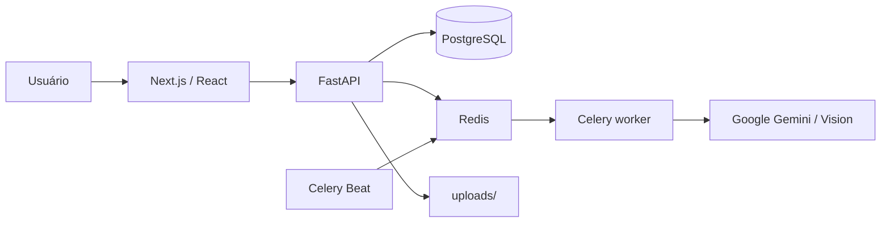

# Flashify

Plataforma de estudo que transforma textos, PDFs, imagens, documentos Word e apresentações PowerPoint em materiais de aprendizagem com apoio de IA. Combina geração de conteúdo, biblioteca de decks, flashcards, quizzes, estudo guiado, revisão espaçada e acompanhamento de progresso.

O projeto é uma aplicação web com frontend Next.js/React, API FastAPI, PostgreSQL, Redis e workers Celery.

## Visão geral

1. o usuário envia texto ou arquivo e cria um deck;
2. a API extrai o conteúdo — inclusive páginas selecionadas de PDFs — e agenda a geração;
3. o worker Celery usa Gemini/Google para produzir flashcards, quiz e estudo guiado;
4. o deck aparece na biblioteca, onde pode ser editado e organizado em pastas;
5. o usuário estuda em flashcards, quiz ou trilha guiada;
6. sessões, respostas, SRS, feedback e atividade alimentam progresso e admin.

O compartilhamento usa snapshots: o link representa o estado congelado do deck no momento do compartilhamento. O destinatário pode consultar o conteúdo em modo somente leitura e importar uma cópia para sua biblioteca.

## Funcionalidades

- geração a partir de texto, PDF, imagem, DOCX e PPTX;
- seleção e pré-visualização de páginas de PDF;
- edição individual ou em massa e escolha do idioma de estudo;
- biblioteca com pastas, busca, ordenação, paginação e revisões pendentes;
- estudo com flashcards, quiz e estudo guiado;
- revisão espaçada (SRS), retomada de sessões e relatórios;
- progresso semanal, streak, estatísticas, ranking e recomendações;
- compartilhamento por snapshot e importação de decks;
- feedback pós-sessão com recompensa única de gerações;
- analytics de aquisição, funil, retenção, rotina, modos e telas;
- painel `/admin` com indicadores, usuários, notas, controles e exportação;
- autenticação por senha e Google OAuth, modo escuro e layout responsivo.

## Arquitetura



| Componente | Responsabilidade |
|---|---|
| `front/` | Rotas, componentes, autenticação, estudo, biblioteca, progresso e admin. |
| `back/app/main.py` | Inicialização da API, CORS e routers. |
| `back/app/routers/` | Endpoints de auth, documentos, flashcards, quizzes, progresso, analytics, pastas e feedback. |
| `back/app/tasks.py` | Extração e geração assíncronas. |
| `back/app/worker.py` | Celery e tarefas periódicas. |
| `back/app/models.py` | Modelos SQLModel, SRS, analytics e snapshots. |
| `back/alembic/` | Migrations do banco. |
| `uploads/` | Arquivos recebidos e artefatos; não versionar. |
| `docs/` | Guias, especificações e releases. |

## Rotas principais

`/dashboard` · `/create` · `/library` · `/deck/:id` · `/study/:id` · `/quiz/:id` · `/guided/:id` · `/progress` · `/support` · `/settings` · `/shared/:token` · `/admin`

A documentação da API fica em `/docs` e `/redoc`.

## Requisitos

- Python 3.11+;
- Node.js compatível com Next.js 14 e pnpm;
- PostgreSQL 15 e Redis 7;
- credenciais Google/Gemini;
- `back/.env` e `front/.env` configurados.

## Execução local

```bash
cd back
python3 -m venv .venv
source .venv/bin/activate
pip install -r requirements.txt
alembic upgrade head
uvicorn app.main:app --reload --port 9000
```

Em outros terminais, com Redis e PostgreSQL disponíveis:

```bash
cd back && source .venv/bin/activate
celery -A app.worker worker --loglevel=info
celery -A app.worker beat --loglevel=info
```

```bash
cd front
pnpm install
pnpm dev
```

## Docker Compose

```bash
docker compose up --build
```

Acesse `http://localhost:4000` e a API em `http://localhost:9000`. O banco é exposto em `5433` e o Redis em `6380`. Produção usa `docker-compose.prod.yml`, `postgres.env`, a rede externa `proxy-net` e `./deploy.sh`.

## Variáveis de ambiente

### Backend

`DATABASE_URL` (ou `DB_USER`, `DB_PASSWORD`, `DB_HOST`, `DB_NAME`), `REDIS_URL`, `GOOGLE_API_KEY`, `GEMINI_MODEL`, `SECRET_KEY`, `ALGORITHM`, `ACCESS_TOKEN_EXPIRE_MINUTES`, `FRONTEND_URL`, `GOOGLE_CLIENT_ID`, `GOOGLE_CLIENT_SECRET`, `REDIRECT_URI`, `ENABLE_EMAILS`, `RESEND_API_KEY`, `EMAIL_ASSETS_BASE_URL`, `WHATSAPP_LINK` e `APP_TIMEZONE`.

### Frontend

`NEXT_PUBLIC_API_BASE_URL`, `NEXT_PUBLIC_GOOGLE_CLIENT_ID`, `NEXT_PUBLIC_GA_MEASUREMENT_ID`, `NEXT_PUBLIC_GOOGLE_ADS_ID` e `NEXT_PUBLIC_CLARITY_PROJECT_ID`.

Nunca versione segredos, `.env` ou `gcp-credentials.json`.

## Banco, validação e documentação

```bash
cd back
alembic upgrade head
alembic current
cd ../front
pnpm build
```

O índice em [`docs/README.md`](docs/README.md) organiza produto, operação, admin, especificações e releases. Novas releases devem copiar [`docs/releases/_template-release.md`](docs/releases/_template-release.md).

## Licença e contato

O repositório ainda não contém informações formais de licença, autor ou contato.
